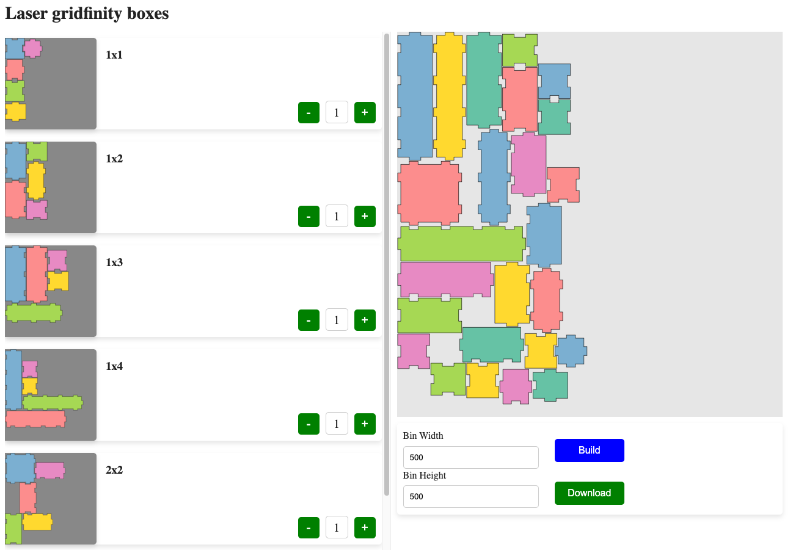
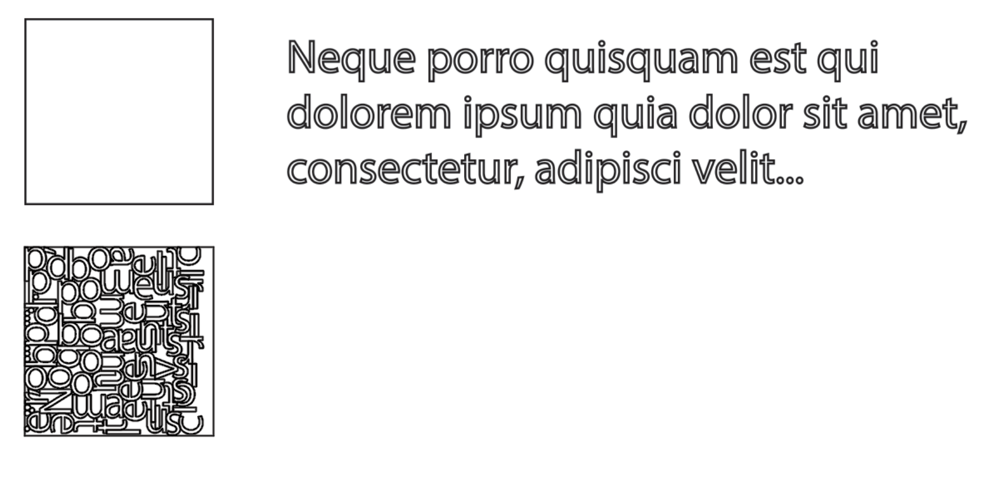

# NestApp

The online platform for Nest algorithm.



## How to use?

#### [Visit Nest2D](https://nest2d.online/)

# What is Nest Problem?

Given a square piece of material and some letters to be laser-cut:

We want to pack all the letters into the square, using as little material as possible. If a single square is not enough,
we also want to minimize the number of squares used.

In the CNC world this is called "nesting", and software that does this is typically targeted at industrial customers and
very expensive.



for more detail , please go to [SVGNest](https://github.com/Jack000/SVGnest)

## The repository based on few github project, I keep the original history of commits.

Also, i have some plane to modify the project. The project will be support DXF file. The SVG format available only for
the preview. The project will be migrate to Kotlin fully or majority.

Fill free to create issues or pull requests. The main goal of the project is mainly free and open source solution for
nesting problem. I try to find the way to compensate the price of cloud server. **You Star of the project can help to
apply to some open source program.**

### Credits:

- [SVGNest](https://github.com/Jack000/SVGnest)
- [DXFReader](https://github.com/wholder/DXFReader)
- [NEST4J fork](https://github.com/micycle1/Nest4J/tree/master)

### Referenced Paper

- [López-Camacho *et al.* 2013](http://www.cs.stir.ac.uk/~goc/papers/EffectiveHueristic2DAOR2013.pdf)
- [Kendall 2000](http://www.graham-kendall.com/papers/k2001.pdf)
- [E.K. Burke *et al.* 2006](http://citeseerx.ist.psu.edu/viewdoc/download?doi=10.1.1.440.379&rep=rep1&type=pdf)

### Extended Attributes of Polygon

When one polygon is constructed , its default Rotation attr is 0 , which means we will fix it during our Nest Program.
We can set it as 4 and this polygon may rotate in 90°,180°,270°. If we set Rotation attr as N, this polygon may these
rotation angles `(360/N) *k , k= 0,1,2,3,...N`

Meanwhile you can use `bid` to help you identify the polygons. It is useful when we get nest result.

``` java
      polygon.bid = id;
      polygon.setRotation(4);
``` 

### Hollow Polygon

For those hollow polgyons, Nest4J provides a simple way to express by 2d coordinate system. If one polygon is inside in
another by their coordinates, the Nest4J will detact it automaticly.

### Configuration

Before we start to nest , you can set configuration.

```java
Config config = new Config();
config.SPACING =0;
config.POPULATION_SIZE =5;
```

<table>
    <tr>
        <td>Attr</td>
        <td>Description</td>
        <td>Default</td>
    </tr>
    <tr>
        <td>SPACING</td>
        <td>the distance of each plygons on bin</td>
        <td>0</td>
    </tr>
    <tr>
        <td>POPULATION_SIZE</td>
        <td>the number of population in GA algorithm</td>
        <td>10</td>
    </tr>
    <tr>
        <td>MUTATION_RATE</td>
        <td>the rate of mutate in GA algorithm</td>
        <td>10%</td>
    </tr> 
    <tr>
        <td>USE_HOLE</td>
        <td>allow to put polygons into hollow polygons</td>
        <td>false</td>
    </tr>     
</table>

## start to nest

When we configure the bin, the material list and the configuration, we can start to nest.

```java

Nest nest = new Nest(bin, polygons, config, 2);
List<List<Placement>> appliedPlacement = nest.startNest();

```

### Placement

Placement is our unit of final result , which represents a polygon with a specific `bid` placed into a rotation angel
and relative coordiates to its bin of top left corner.

```java
public class Placement {
    public int bid;
    public Segment translate;
    public double rotate;


    public Placement(int bid, Segment translate, double rotate) {
        this.bid = bid;
        this.translate = translate;
        this.rotate = rotate;
    }

    public Placement() {
    }
}

```


